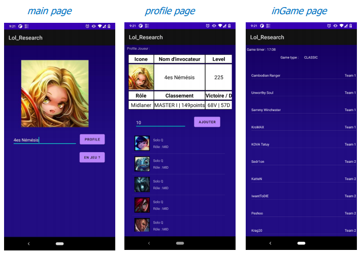

# Lol_Research 
Cette application Android est directement liée aux API de Riot Games et permet les fonctionnalités suivantes : 

-	Recherche d’un joueur par son pseudonyme : affichage de son profil et de ses stats
-	Affichage de son historique de parties modulables par une entré utilisateur, utilisation de Recycle View
-	Recherche d’un joueur en partie, si celui-ci est bel et bien en partie, affichage de ses coéquipiers ainsi que certaines stats utile au joueur
 

---

## Stack utilisée 
- IDE : **Android Studio**
- Back-End : **Java 8**
- Front-end : **XML**
---

## Licence

- **[MIT license](http://opensource.org/licenses/mit-license.php)**
- Copyright 2021 ©  **<a href="https://www.linkedin.com/in/vincent-bernet/" target="_blank">Bernet Vincent Marie</a>, <a href="https://github.com/Stelenight">SteleNight</a>**
